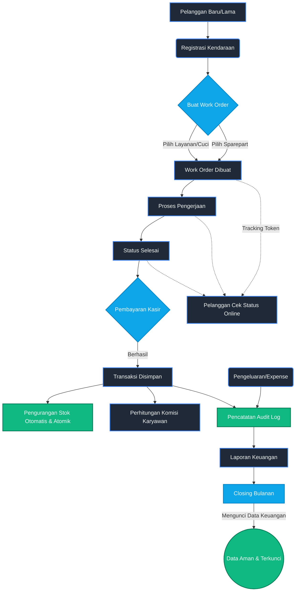

# Workshop Management System

Sistem manajemen bengkel yang komprehensif, aman, dan siap produksi, dirancang untuk mengelola pelanggan, kendaraan, inventory (stok), pesanan kerja (work orders), komisi karyawan, serta laporan keuangan dengan integritas data tingkat tinggi.

## 🌟 Fitur Utama

- **Work Order Management:** Pembuatan dan pelacakan pesanan kerja dengan status real-time.
- **Atomic Inventory Control:** Penyesuaian stok yang sepenuhnya atomik untuk mencegah *race conditions*, terintegrasi dengan otomatisasi pengurangan stok saat Work Order selesai.
- **Financial Period Locking:** Kunci bulanan untuk mencegah modifikasi data keuangan secara retroaktif (Closing Buku).
- **Public Tracking Portal:** Portal privasi-pertama bagi pelanggan untuk melacak status servis kendaraan melalui token khusus (tanpa detail harga untuk alasan keamanan).
- **Comprehensive Audit Trail:** Fire-and-forget Audit Log untuk melacak semua operasi kritis (Update Transaksi, Delete Expense, Closing Bulanan, dll.) tanpa memperlambat response time.
- **Robust Validation:** Validasi menyeluruh pada frontend dan backend menggunakan Zod.
- **Secure Authentication:** Validasi session aktif secara real-time yang langsung menolak token dari karyawan yang baru saja dinonaktifkan.
- **Centralized Error Handling:** Pemetaan error Prisma (Unique Constraint, Foreign Key, dll) ke status HTTP yang ramah client.

## 🚀 Teknologi

- **Framework:** Next.js 14 (App Router)
- **Language:** TypeScript
- **Database ORM:** Prisma
- **Database Engine:** PostgreSQL
- **Authentication:** NextAuth.js (v5)
- **Validation:** Zod
- **Testing:** Vitest
- **Styling:** Tailwind CSS + Radix UI

## 📋 Alur Sistem (Flowchart)



## 🛡️ Standar Keamanan & Integritas (Production-Ready)

Aplikasi ini telah diperkuat (hardened) untuk memenuhi standar *production-ready*:

1. **Atomic Stock Update:** Menggunakan Prisma `$transaction` dengan `{ increment/decrement }` pada level database untuk mematikan risiko *Race Conditions* saat kasir memproses banyak pesanan sekaligus.
2. **Duplicate Plate Protection:** Validasi *case-insensitive* berlapis (Zod + Prisma Unique Constraint + Custom Error Mapping) mencegah satu kendaraan didaftarkan dua kali.
3. **Monthly Closing Lock:** Segala bentuk *Create/Update/Delete* terhadap Data Transaksi, Work Order, dan Expense akan di-block jika tanggal data masuk ke dalam bulan yang telah berstatus `CLOSED`.
4. **Active Session Validation:** `auth.ts` melakukan pengecekan `isActive` pada database di level session JWT. Jika admin menonaktifkan akun kasir/mekanik, akses mereka langsung terpotong saat itu juga.
5. **Data Privacy Tracking:** API Pelacakan Publik tidak pernah mengekspos data sensitif (Total Harga, Harga Satuan, Nama Karyawan). Pelanggan hanya melihat progress dan layanan apa yang sedang dikerjakan.
6. **Graceful Error Handling:** Memiliki `error.tsx` Global, `not-found.tsx`, dan Error Boundary Dashboard untuk mencegah *White Screen of Death*.

## 🚦 Memulai Proyek Lokal

1. **Install Dependencies**
   ```bash
   npm install
   ```

2. **Setup Environment Variables**
   Buat file `.env` berdasarkan `.env.example` dan masukkan URL Database PostgreSQL serta Auth Secret Anda.

3. **Database Migration & Sync**
   ```bash
   npx prisma generate
   npx prisma db push
   ```

4. **Jalankan Development Server**
   ```bash
   npm run dev
   ```

5. **Jalankan Testing**
   ```bash
   npx vitest run
   ```

## 📄 Struktur Direktori Penting

- `/app/api`: Semua endpoint backend, terproteksi oleh auth dan error handler.
- `/lib/validations.ts`: Skema *Zod* terpusat (Single Source of Truth) untuk validasi payload.
- `/lib/prisma-errors.ts`: *Interceptor* yang menerjemahkan error internal database menjadi HTTP error yang aman.
- `/lib/closing-lock.ts`: Engine *financial lock* bulanan.
- `/lib/audit.ts`: Modul pencatatan Audit Trail (Fire-and-Forget pattern).
- `/__tests__`: Berisi pengujian logika krusial (*Validations*, *Closing Lock*, *Prisma Error*).

---
*Dibuat untuk Manajemen Bengkel Modern dengan Fokus pada Integritas dan Keamanan Data.*
